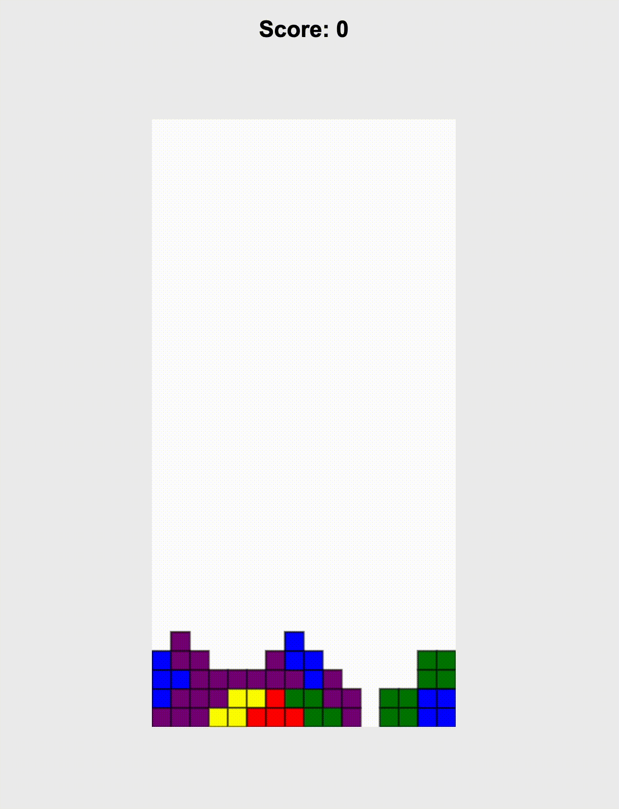
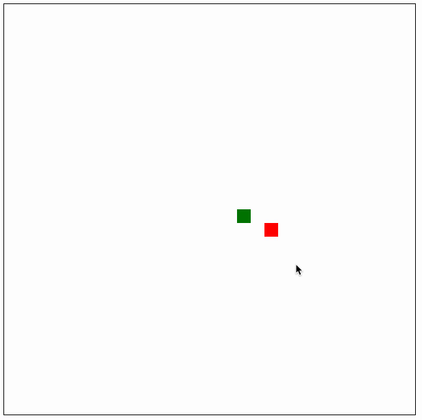
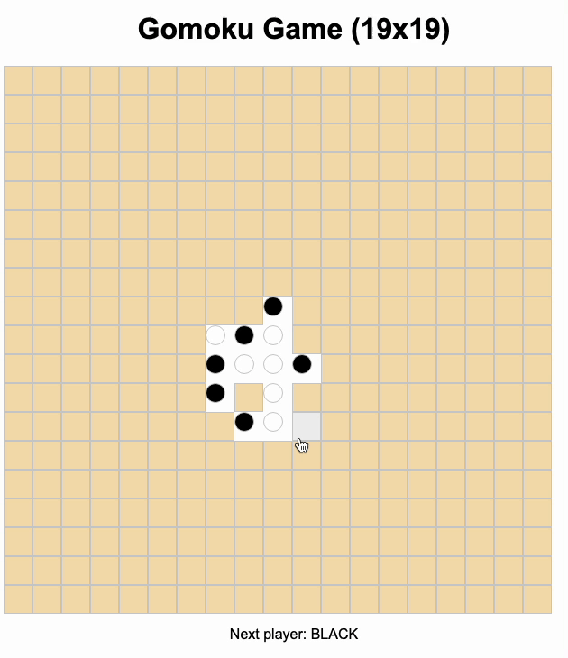
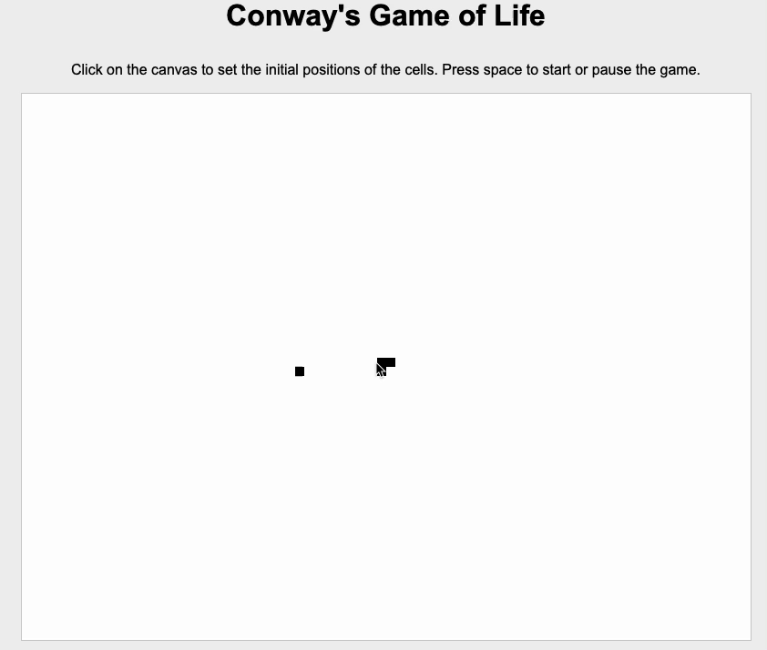
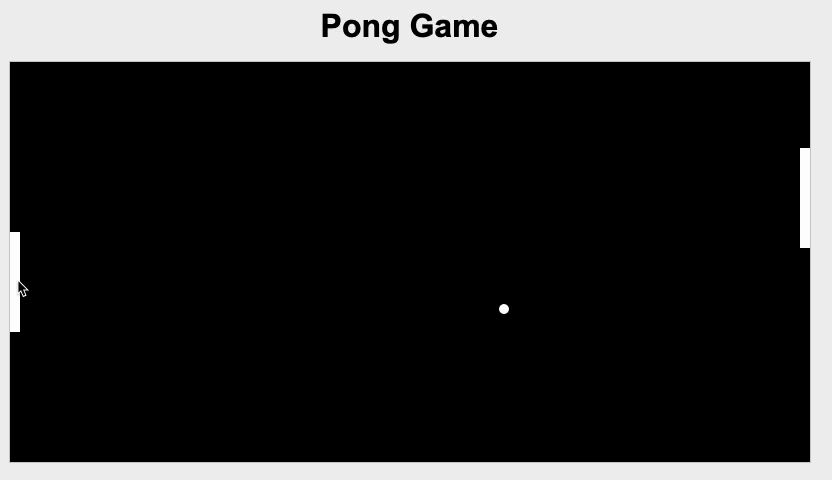
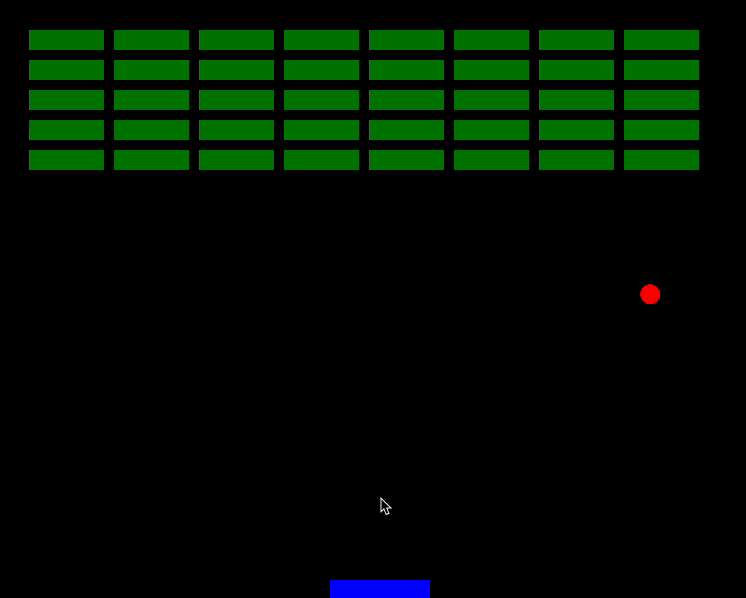

# 🕹️ Awesome GPT Games🔥

🎆 EVERYONE CAN BE A GAME DEVELOPER WITH GPT!

💥 GPT-4's incredible code generation capabilities enable game development using simple text prompts.

🎮 We try to gather all text prompts that can generate entertaining games in one shot.

🌟 Feel free to submit PRs. We need more cool game ideas!

🧪 Let's explore what is the boundary of GPT-4 for game development!

🚀 Supported games:

* [Zombie Shoot](#zombie-shoot)
* [Tetris](#tetris)
* [Snake](#snake)
* [Gokomu](#gokomu)
* [Conway's Game of Life](#conway-s-game-of-life)
* [Pong](#pong)
* [Breakout Clone](#breakout-clone)

🔍 Discovered Prompt Tips:

* More complicated games include more possibilities, which means that we need to generate multiple times using the prompt to get a correct game.
* If the length of the code exceeds the limitation of one time generation, we just use "continue generating" to get the full code.

### Zombie Shoot

contributed by **[Naruto9811](https://github.com/Naruto9811)** 

Prompt:

> As a professional game developer, your task is to create a complete code for a pixel-style shooting zombie game using Javascript, CSS, and HTML. The player's movement should be controlled by the WASD keys, while the spacebar is used to shoot and QE are used to switch weapons. However, the number of bullets in each weapon is limited. There are ten different types of weapons in the game: AK-47 assault rifle, MP5 submachine gun, Glock pistol, Remington 870 shotgun, Barrett M82A1 sniper rifle, RPG grenade launcher, Mossberg 500 shotgun, M249 light machine gun, M72 LAW rocket launcher, GAU-17/A machine gun. There are two types of zombies in the game: gray normal zombies and red demon zombies. The player will die if attacked by normal zombies ten times or demon zombies four times. Additionally, there will be randomly generated red squares on the field that can replenish the player's health and ammunition. Your response should include well-commented code that implements all of these features with attention to detail and accuracy. Please ensure that your code provides clear instructions on how to play the game and includes appropriate error handling measures.

Game Demo:
Amazing! Even support diverse weapon change.

### Tetris

contributed by **[Jasonqi146](https://github.com/Jasonqi146)**

Prompt: 

> You are a game developer. I want you to generate a simple code for a standard Tetris game that can run on the web page with HTML, CSS, and JS. Please also implement collision detection. When the piece touches the bottom, it stays there, and then another piece is generated. Please also implement the following game logic. Whenever a row is filled, this row is eliminated, and the player gets 100 scores. If x rows are eliminated together, the player gets x*x*100 scores for each row. The key listeners are written this way: ‘a’ for moving left, ‘d’ for moving right, ‘s’ for moving down, and ‘w’ for rotating. Please also implement a scoreboard that shows players their scores. I want random colors on pieces. Don't worry about exceeding the word limit, you can always pick up from where you left over. Generate the JS first.

Game Demo:

### Snake

contributed by **[lwaekfjlk](https://github.com/lwaekfjlk)**

Prompt: 

> You are a game developer. I want you to generate a Snake-like game. Players can use the arrow keys to control the direction of the snake. Moreover, the snake is green and its food is red. The snake grows when it eats the food (red square) and dies if it hits the canvas boundaries or itself. At the beginning, the snake appears at the middle of the screen at the beginning.  Its food (red square) is randomly generated at first and continues generate when some of the food is eaten. You should make sure that there is always some food on the screen. Generate the JS file first.

Game Demo: 

### Gokomu

contributed by **[Naruto9811](https://github.com/Naruto9811)**

Prompt: 

> You are a game developer now. Generate a complete implement of the gokomu game for two player with HTML, CSS and Javascript. Players alternate turns placing a stone of their color on an empty intersection. Black plays first. The winner is the first player to form an unbroken line of five stones of their color horizontally, vertically, or diagonally. If the board is completely filled and no one can make a line of 5 stones, then it will result in a draw. The board size is 19 x 19. Please generate the code and the tree structure of the project.

Game Demo:

### Conway's Game of Life

contributed by **[lwaekfjlk](https://github.com/lwaekfjlk)**

Prompt: 

> You are a game developer, I want you to generate Conway's Game of Life that can run on the web page with HTML, CSS, and JS. I can use the mouse to set the initial positions of the cells in the game and press space to start or pause the game. The cells change their status every 0.5 seconds. Generate the JS file first. Generate HTML and CSS after that.

Game Demo:

### Pong

contributed by **[lwaekfjlk](https://github.com/lwaekfjlk)**

Prompt: 

> You are a game developer. I want you to build a pong-like game that can run on the browser. People can control the position of the board.

Game Demo:

### Breakout Clone

contributed by **[lwaekfjlk](https://github.com/lwaekfjlk)**

Prompt:

> You are a game developer. You need to generate a Breakout clone game that can be run in the browser. You need to make sure that the speed of the ball is reasonable for players to catch. The player should move their mouse to control the board. I want the game to show restart automatically when we delete all the bricks or the ball drops. Generate the JS first.

Game Demo:

